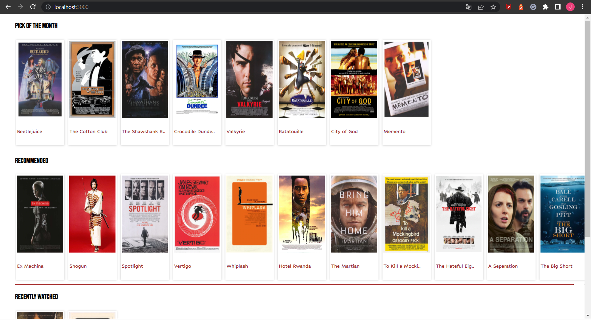
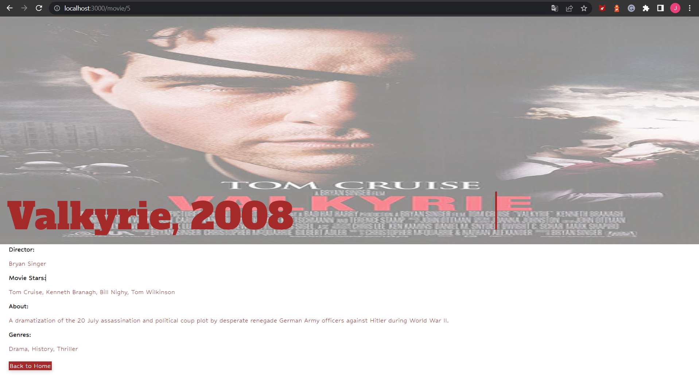
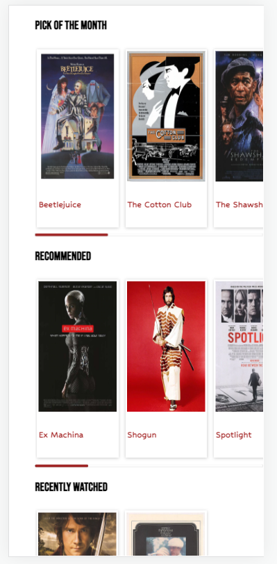
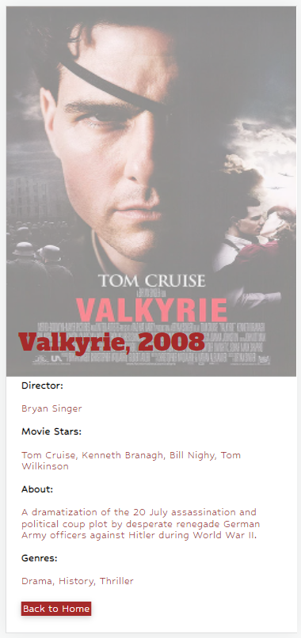

# Movies

To develop this application was used Reactjs library with typescript template.

The app UI was designed as responsive for mobile and web version. Mobile UI tested with chrome developer tools: iPhone 12 screen.

## Web UI examples





## Mobile UI examples





## Install dependencies

Before starting application be sure that you install all dependencies

```bash

npm i

```

## Run application

To start the app run the command below:

```bash

npm start

```

The app will run on the http://localhost:3000

If any issues please contact owner of the repository.